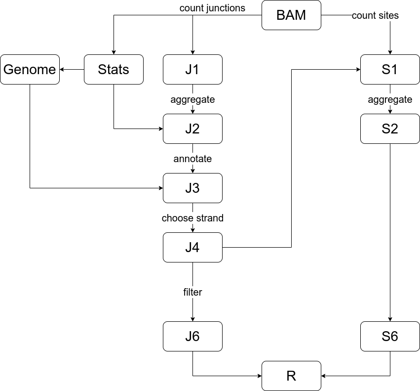

Introduction
============

pyIPSA (Integrative Pipeline for Splicing Analysis) is a set of tools integrated into a pipeline
for alternative splicing analysis. It quantifies splicing estimates such as inclusion and exclusion rates
of splicing sites. pyIPSA works fully automatically:
you just need to provide input and output folder, the rest pyIPSA will do for you.

The pyIPSA workflow consists of several tools which process alignment files.

Each tool has its own output which is used as input for the
